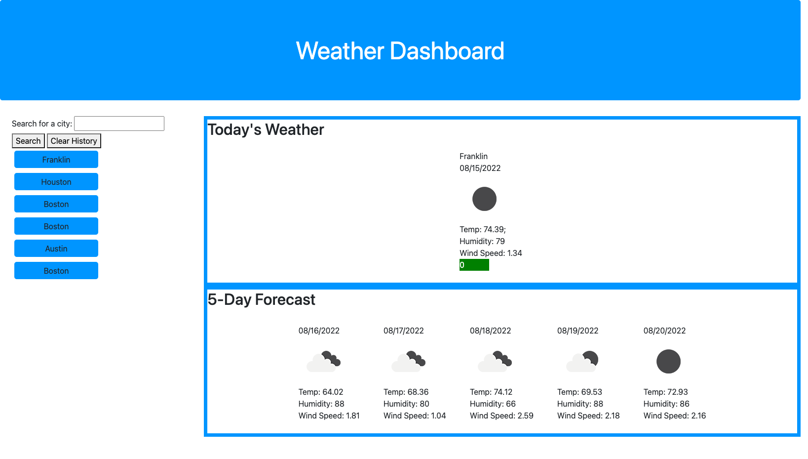

# weather-dashboard
## Weather Dashboard

Deployed Link:
[https://sprantis.github.io/weather-dashboard/]

Description:
I have created a weather dashboard application to allow users to enter in a city of their choice and get current and future weather data for that area. The dashboard shows information like temperature, humidity, wind speed, and UV index. Local storage is used to save a history of the user's previous searches.

Screenshot:

Repo Link:
[https://github.com/sprantis/weather-dashboard]